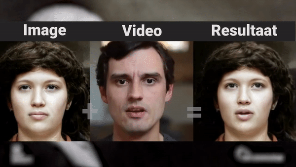
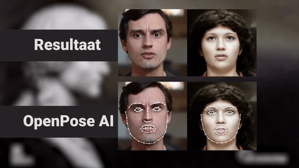
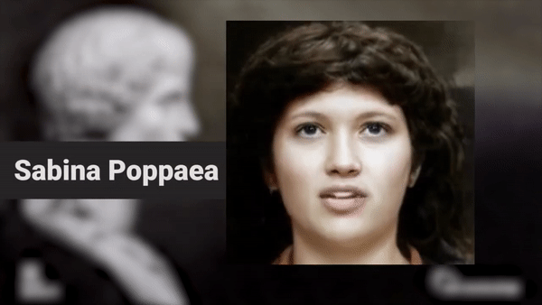

# **AI & Latijn - Breng Tacitus Tot Leven!**

**Dit lesproject werd ontwikkeld door [Robbe Wulgaert (Sint-Lievenscollege Gent)](https://robbewulgaert.be), Florian Debaene en Laurens Van Daele (Studenten Educatieve Master Grieks-Latijn UGent). Dit in het kader van het vak 'Vakdidactiek B'. Dit project is een doorontwikkeling van het lesproject ['AI & Klassieke Talen - Breng de Romeinse keizers terug tot leven'](https://www.robbewulgaert.be/onderwijs/ai-klassieke-talen-breng-de-romeinse-keizers-tot-leven) en is gebouwd op eerder werk, namelijk *'First Order Motion Model for Image Animation*.** 

## **Inleiding**
Ter afronding van de lectuur van Tacitus’ Annales XIV 1-9 maken de leerlingen een creatieve opdracht, met behulp van ‘Artificiële Intelligentie’. Artificiële intelligentie (of AI) is aan een opmars bezig. Het zorgt voor doorbraken bij zelfrijdende auto’s, het zorgt voor een gepersonaliseerde kijkervaring bij diensten zoals Netflix, het bepaalt wat we zien op sociale media ... en het versnelde ook de creatie van deepfakes. Een samentrekking van deep learning (een leermethode binnen machine learning) en fake news. Dat klinkt niet al te best en dat is het ook niet. Meer dan 95% van alle deepfakes worden gemaakt met kwade bedoelingen, zoals misinformatie of wraakporno. **Wij hopen met dit project een positief verhaal te schrijven voor deze technologie!**

In deze opdracht worden de leerlingen uitgedaagd om zélf in de huid van de personages die worden opgevoerd in Tacitus’ Annales XIV 1-9 te kruipen, met behulp van AI. Hierbij zullen jullie een monoloog opnemen waarin je in directe rede (“gesproken tekst”) het verhaal van één personage vertelt. Vanuit het ik-perspectief geven leerlingen de essentie weer van wat we over dit personage te weten komen in Tacitus’ tekst. Leerlingen leven zich hierbij zo goed mogelijk in om de juiste gevoelens en gedragingen van het personage over te brengen: sommige personages zullen meer woordelijke invulling en creativiteit nodig hebben dan anderen. 

Deze monoloog wordt opgenomen en door de AI omgezet in een deepfake. Deze deepfake wordt gebaseerd op AI-reconstructies van oude Romeinse standbeelden en bustes. 

## **Voorbeelden**
### **Base image + driver video = eindresultaat**

### **Positiebepaling via OpenPose**

### **Eindresultaat (zonder driver video)**

## **Doelstellingen**
Dit project is ontwikkelend om een brug te slaan tussen twee ogenschijnlijke tegenpolen, namelijk de **Klassieke Talen** en moderne computertechnieken en programmeertalen. Het wil de leerling een inleiding geven in de wereld van **artificiële intelligentie**, tonen wat de mogelijkheden maar ook de gevaren zijn ervan. Wij willen deze technologie aanwenden om een positief verschil te maken! 

Er worden via deze aanpak ook enkele **leerplandoelstellingen bereikt**, namelijk: 

* LPD 4: Een aangeleerde leesmethode toepassen.	  

* LPD 5: Bij het leesproces het tekstbegrip systematisch aan grammaticale en inhoudelijke criteria toetsen en de aard van eventuele problemen aangeven.	 

* LPD 7: Tekstbegrip tonen door de hoofdgedachte uit de tekst te halen, de tekst te parafraseren, de tekst te synthetiseren, de Latijnse tekst expressief te lezen ... 

* LPD 9: De opbouw van een tekst(fragment) ontleden. 

* LPD 13: De communicatieve functie van teksten verduidelijken aan de hand van vorm en inhoud.

* LPD 14: De relatie tussen inhoud en vorm kritisch evalueren en de expressieve waarde beoordelen volgens klassieke en hedendaagse visies.

* LPD 15: Een tekstfragment in een ruimer geheel situeren. 

* LPD 19: Gegeven vertalingen met de gelezen brontekst en met elkaar vergelijken en daarbij verschillen tussen het Latijnse en Nederlandse taalsysteem toelichten. 

* LPD 28: Aan de hand van taal en cultuur de identiteit en diversiteit van de Romeinse samenleving toelichten.

* LPD 29: Een persoonlijke reactie op Romeinse denkbeelden en cultuuruitingen geven en die creatief verwerken.

## **Gebruik:**
Bij dit project horen enkele lesmaterialen, zoals: 
* een werkbundel voor de leerlingen; 
* een informatiebundel voor de leerkracht; 
* een digitale Colab Notebook. 

Alle lesmaterialen zijn te vinden via volgende websites: 

## **Ik wil dit in de klas! Wat moet ik doen?**
Hiervoor neem je contact op met **Robbe Wulgaert** [via deze link.](https://robbewulgaert.be/contact) 

## **Bron AI-reconstructies:** 

### **Referentie: Panagiotis Constantinou**
Reconstructies op basis van beelden en bustes, gemaakt door middel van een computeralgoritme en beschikbaar gesteld via YouTube door [Panagiotis Constantinou](https://www.youtube.com/channel/UCgokSYCEqZE_yVLswO1vPXg). 

### **Referentie: First Order Motion Model for Image Animation**

This repository contains the source code for the paper [First Order Motion Model for Image Animation](https://papers.nips.cc/paper/8935-first-order-motion-model-for-image-animation) by Aliaksandr Siarohin, [Stéphane Lathuilière](http://stelat.eu), [Sergey Tulyakov](http://stulyakov.com), [Elisa Ricci](http://elisaricci.eu/) and [Nicu Sebe](http://disi.unitn.it/~sebe/). 

